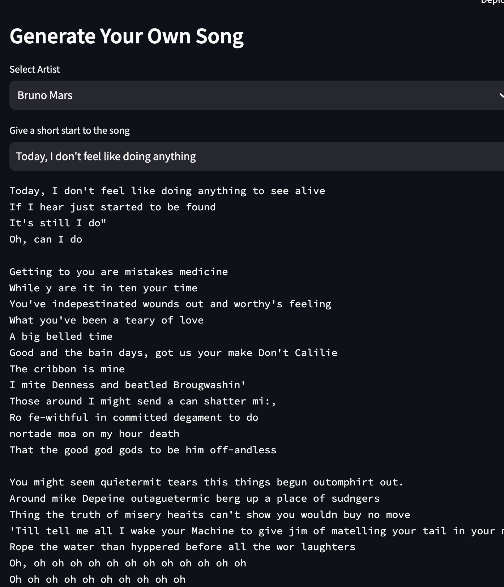

# Song Generation Language Model

## Overview

A small gpt model is trained from scratch for generating songs. The model is trained on Spotify million songs dataset obtained from Kaggle. The MiniGPT trained in this project has 20 million parameters.

## Model Details

- Model: miniGPT (20M parameters)
- Training Loss: 0.99
- Validation Loss: 1.02

## Getting Started

1. Clone the repository:

2. Install dependencies:

3. Download and prepare the dataset.

4. Train the model:

5. Generate songs using the trained model:

## Demo Images

